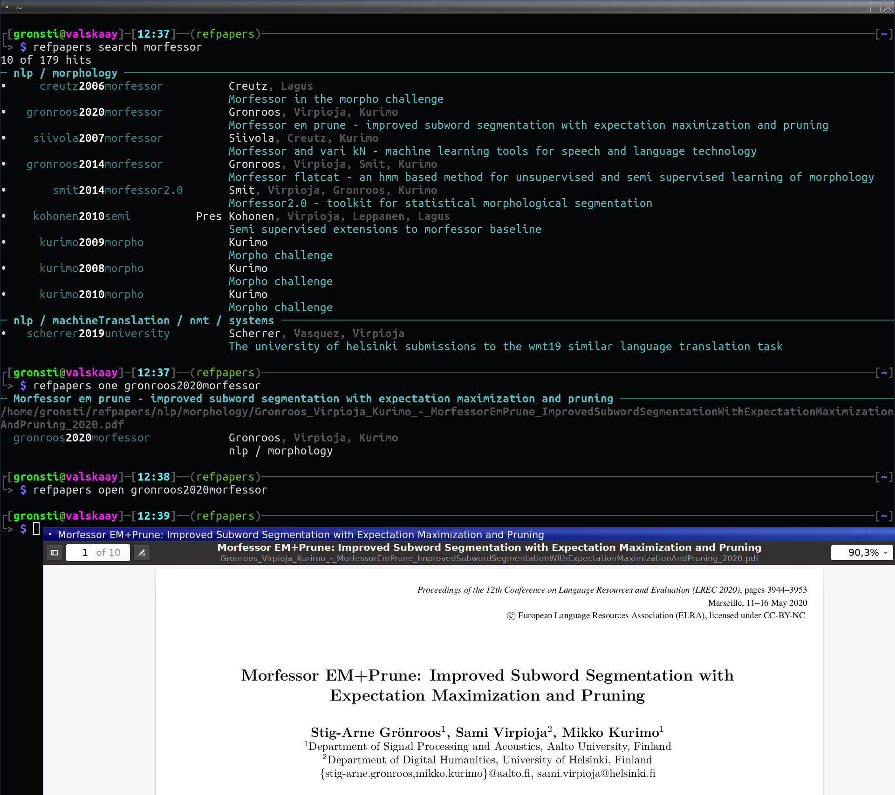

=========
refpapers
=========

.. image:: https://img.shields.io/pypi/v/refpapers.svg
        :target: https://pypi.python.org/pypi/refpapers

.. image:: https://readthedocs.org/projects/refpapers/badge/?version=latest
        :target: https://refpapers.readthedocs.io/en/latest/?version=latest
        :alt: Documentation Status

Lightweight command-line tool to manage bibliography (pdf collection)

* Free software: MIT License
* Documentation: https://refpapers.readthedocs.io.

Installing
------------

  .. code-block:: bash

    pip install refpapers

Depenencies (not including those automatically installed from pypi)

* Python 3
* pdftotext (from poppler-utils, Ubuntu: sudo apt install poppler-utils)

Introduction
------------

Motivation
~~~~~~~~~~
* Research involves reading a large number of scientific papers, and being able to later refer back to what you have read.
  Each time searching again in online databases or search engines is cumbersome,
  and unless remembering the exact title, you are likely to find new papers instead of the one you read previously.
* Keeping a personal database of the papers you read solves this problem.
  Such a collection grows rapidly, necessitating a performant local search engine.

File names as source of truth
~~~~~~~~~~~~~~~~~~~~~~~~~~~~~

* Refpapers uses the files themselves as a source of truth.
  Metadata, such as authors, title, and publication year are encoded in the filename.
  Full text is extracted from the file contents.
* For performance reasons, the data is indexed into a whoosh database.
  However, the database is only a cache: All the data is stored directly in the file.
* Using the file as a source of truth is useful in several ways:
    * If you send pdf files to other people or to yourself on machines without refpapers installed,
      your files will be systematically named with all the information you need.
    * You can choose to stop using refpapers, and the work you put into curating your collection will not be wasted.

Refpapers is opinionated
~~~~~~~~~~~~~~~~~~~~~~~~

* The naming scheme is fixed: The basic pattern is :code:`FirstAuthor_SecondAuthor_-_PaperTitle_0000.pdf`.
  The main fields are given in a fixed order, and the separator is mandatory.
  However, you don't need to write this format yourself: the automatic renaming tool takes care of it for you.
* Bibtex keys are in the form :code:`surname0000word`,
  with the surname of the first author, year, and the first word of the title (excluding stopwords).
* If you like, other naming formats that encode the same information could be supported.
  All the code for implementing this is in :code:`filesystem.py`. Pull requests are welcome!

Features
--------

* Powerful **full-text search**.
* **Fast**, even with a large collection of papers.
* Use **git-annex** to track newly added papers to speed up indexing (optional).
* Automatically **retrieve metadata** from several APIs: ArXiv, crossref, Google Scholar.
* Userfriendly **autocomplete** when manually entering metadata.
* **Configurable**. Can support any document format, if you provide a tool to extract plain text. 

Planned features
~~~~~~~~~~~~~~~~

* BibTeX integration.
* Improved data quality check, e.g. deduplication.

Features that will not be implemented
~~~~~~~~~~~~~~~~~~~~~~~~~~~~~~~~~~~~~

* **Built-in synch:** refpapers is designed to work well together with git-annex.
  To synch your papers between multiple machines, you should use git-annex.

Command line usage
------------------

The :code:`refpapers` command line interface is divided into several subcommands, each with their own argument signature.
This is the same type of interface that e.g. :code:`git` uses.
The overall structure is :code:`refpapers <subcommand> [OPTIONS] [ARGUMENTS]`, for example :code:`refpapers search gronroos` uses the :code:`search` subcommand, with the query term :code:`gronroos`.

See the `documentation <https://refpapers.readthedocs.io/en/latest/?version=latest>`_ for details.

**A list of subcommands for search:**

* **refpapers search**: Search for papers.
* **refpapers one**: Show details of one paper.
* **refpapers open**: Open one paper in viewer.

**A list of subcommands for managing your data:**

* **refpapers index**: Refresh the search index.
* **refpapers rename**: Propose renaming a single file automatically.
* **refpapers inbox**: Ingest files in inbox.

    * auto-rename all the files in the inbox,
    * commit the new files into git-annex,
    * sync the contents of git-annex,
    * index to make the new files searchable.

* **refpapers check**: Check for data issues.

Configuration
-------------

If you run refpapers without a configuration, it will ask for the information necessary to write a minimal config.
However, to use all the features of refpapers, you should edit the configuration file.

A full-featured example configuration file can be found in `example_conf/conf.yml <https://github.com/Waino/refpapers/blob/master/example_conf/conf.yml>`_.

My workflow
-----------

* As I browse, I download pdfs into an "inbox" directory (separate from the main collection).
* In the inbox directory, I run :code:`refpapers inbox --open`.
    * This auto-renames all the files in the inbox, commits the new files into git-annex,
      syncs the contents of git-annex, and indexes the new files.
* On other machines, I run :code:`git annex sync --content`, and then reindex. Now the files are available on those machines as well.
* Periodically, I run `refpapers check` to check for problems.

Alternatives
------------

* **papers** https://github.com/perrette/papers . Similar renaming functionality and API integrations. BibTeX integration.
* **zotero** https://www.zotero.org/ . A feature-rich GUI tool.
* **mendeley** https://www.mendeley.com/ . A proprietary tool, owned by Elsevier.

Acknowledgements
----------------

Thank you to arXiv for use of its open access interoperability.

Citing
------

If you find refpapers to be useful when writing your thesis or other scientific publications, please consider acknowledgeing it

  .. code-block:: bibtex

    @misc{refpapers,
        title={Refpapers: Lightweight command-line tool to manage bibliography},
        author={Grönroos, Stig-Arne},
        year={2022},
        note={\url{https://github.com/Waino/refpapers}},
    }
