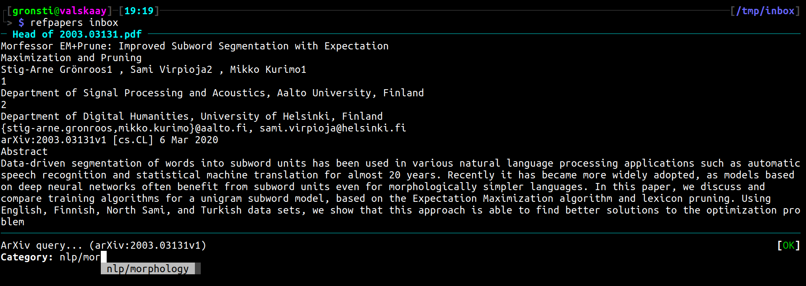
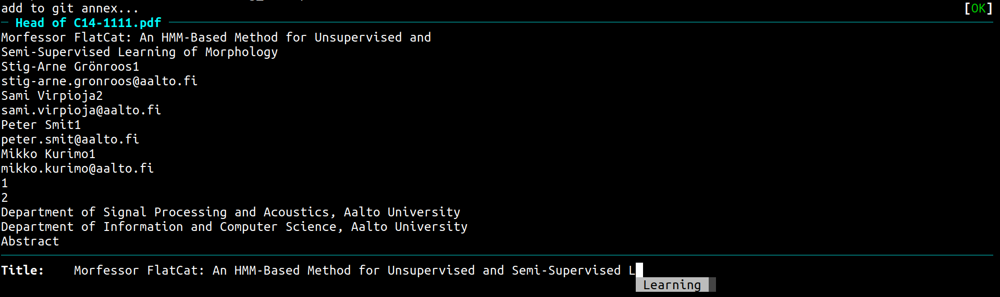

.. _Usage:

Command line usage
==================

The :code:`refpapers` command line interface is divided into several subcommands, each with their own argument signature.
This is the same type of interface that e.g. :code:`git` uses.
The overall structure is :code:`refpapers <subcommand> [OPTIONS] [ARGUMENTS]`, for example :code:`refpapers search gronroos` uses the :code:`search` subcommand, with the query term :code:`gronroos`.

Subcommands for search
----------------------

.. image:: figures/search_one_open.png
        :alt: Screenshot of search functionality

refpapers search
~~~~~~~~~~~~~~~~

Search for papers

The search uses the `whoosh default query language <https://whoosh.readthedocs.io/en/latest/querylang.html>`_.
You can e.g. select the field to search, use boolean operators, truncation, range queries and more.

refpapers one
~~~~~~~~~~~~~

Show details of one paper.

A search is performed using the given query, and the details for the best match are shown.
The most reliable way to select a single paper is to search by bibtex key.

refpapers open
~~~~~~~~~~~~~~

Open one paper in viewer.

A search is performed using the given query, and the best match is opened in a separate viewer.
The most reliable way to select a single paper is to search by bibtex key.

Subcommands for managing your data
----------------------------------

refpapers index
~~~~~~~~~~~~~~~

Refresh the search index.

By deafult a fast incremental search will be used if git is enabled.
A full reindexing can be forced with the :code:`--full` flag.

refpapers rename
~~~~~~~~~~~~~~~~

Propose renaming a single file automatically.

refpapers inbox
~~~~~~~~~~~~~~~

Ingest files in inbox:

* **auto-rename** all the files in the inbox,
* **commit** the new files into git-annex,
* **sync** the contents of git-annex,
* **index** to make the new files searchable.

The :code:`--open` flag causes documents to be opened in the viewer before renaming.
If you have the papers in fresh memory, you can omit this.
Otherwise, use it to remind yourself what the paper was about.

refpapers check
~~~~~~~~~~~~~~~

Check for data issues.

My workflow
-----------

* As I browse, I download pdfs into an "inbox" directory (separate from the main collection).
* In the inbox directory, I run :code:`refpapers inbox --open`.
    * This auto-renames all the files in the inbox, commits the new files into git-annex,
      syncs the contents of git-annex, and indexes the new files.
* On other machines, I run :code:`git annex sync --content`, and then reindex. Now the files are available on those machines as well.
* Periodically, I run `refpapers check` to check for problems.
